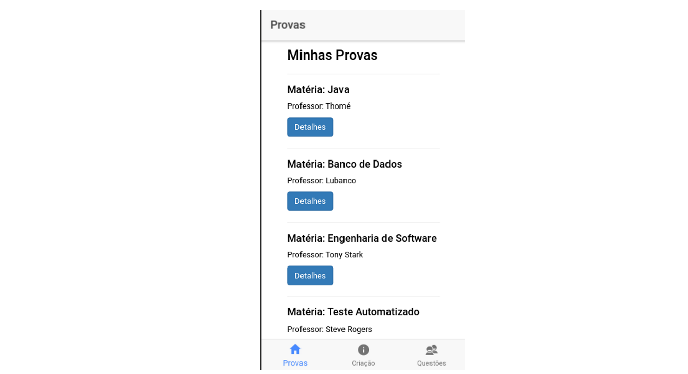
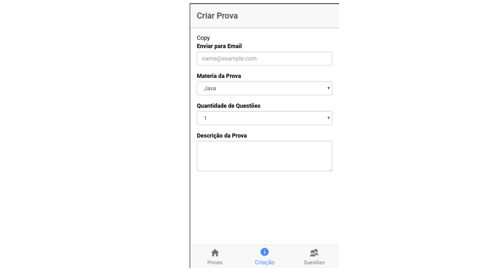

# Gerador de Provas - APP

#### Dados da Aplicação
```
Frontend -  Ionic 4 - Angular 5 -  Bootstrap 3
```         

#### Aplicativo desenvolvido para professores terem facilidade ao desenvolver uma prova,
#### o professor irá selecionar a matéria e será retornado todas as questões daquela matéria para o professor montar sua prova.





